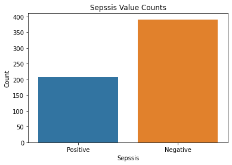
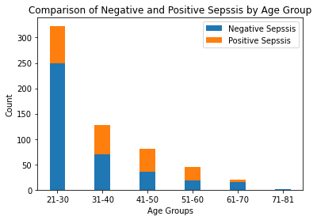
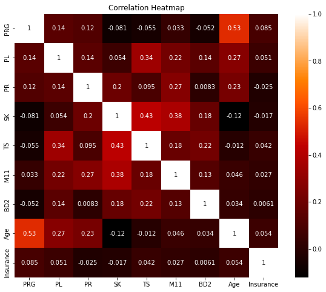
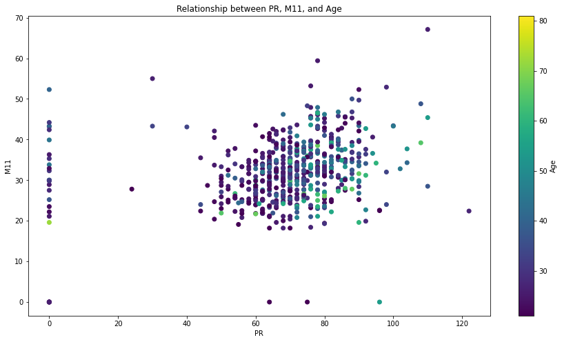
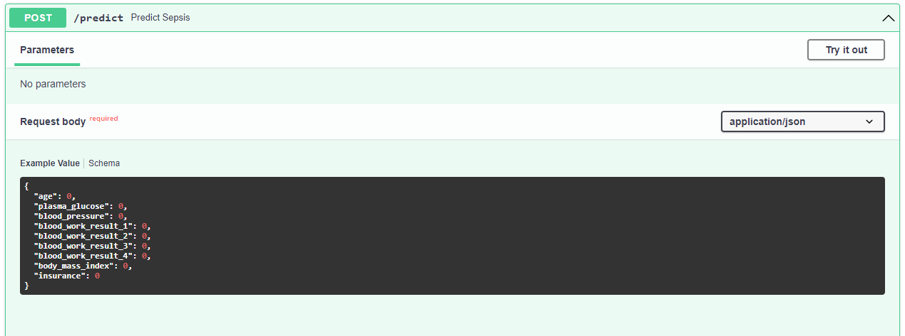

# Sepsis-Prediction

## Description
This repository contains code, data, and resources for a machine learning project that classifies sepsis and provides an API for accessing the trained model using FastAPI.

## Introduction
Sepsis, a life-threatening condition caused by the body’s response to an infection, continues to pose a significant challenge in healthcare settings worldwide. Prompt recognition and timely intervention are crucial to improve patient outcomes and reduce mortality rates associated with sepsis. In this context, the use of predictive models and advanced technology has emerged as a promising approach to aid in the early detection and diagnosis of sepsis.

The aim of this report is to present the findings of our sepsis prediction project, which focuses on assessing the likelihood of a patient developing sepsis based on a few parameters. By analyzing and modeling relevant clinical data, we aim to develop an accurate and reliable system that can assist healthcare professionals in identifying patients at higher risk of sepsis.

The API is built using FastAPI.

## Dataset
The dataset used for training and testing can be found in the Datasets directory. It contains anonymized patient records with different features . The target variable indicates whether the patient has sepsis or not.

The feature are as follows:
| Column Name | Data Features | Description                                      |
|-------------|-----------------|--------------------------------------------------|
| ID          | N/A             | Unique number to represent patient ID             |
| PRG         | Attribute 1     | Plasma glucose                                   |
| PL          | Attribute 2     | Blood Work Result-1 (mu U/ml)                    |
| PR          | Attribute 3     | Blood Pressure (mm Hg)                           |
| SK          | Attribute 4     | Blood Work Result-2 (mm)                         |
| TS          | Attribute 5     | Blood Work Result-3 (mu U/ml)                    |
| M11         | Attribute 6     | Body mass index (weight in kg/(height in m)^2)   |
| BD2         | Attribute 7     | Blood Work Result-4 (mu U/ml)                    |
| Age         | Attribute 8     | Patient's age (years)                            |
| Insurance   | N/A             | If a patient holds a valid insurance card         |
| Sepsis      | Target          | Positive: if a patient in ICU will develop sepsis,<br> Negative: otherwise |

## Exploratory Data Analysis
This is the process of examining and visualizing a dataset to understand its main characteristics, patterns, and relationships between variables. It is an essential step in the data analysis pipeline and helps in gaining insights, identifying patterns, and formulating hypotheses.






## Deployment

The folder includes all the essential files and configurations needed to deploy the model as an API using FastAPI. The main.py file contains the API implementation code, while the Dockerfile provides instructions for containerizing the application. The requirements.txt file lists all the Python dependencies required for running the API.


## Set up

for windows:
1.Create the Python's virtual environment that isolates the required libraries of the project to avoid conflicts\
```bash
python -m venv venv
```
2.Activate the Python's virtual environment so that the Python kernel & libraries will be those of the isolated environment;\
```bash
venv\Scripts\activate
```


## Usage
To use the API, follow the instructions below:

Clone the repository to your local machine \ git clone https://github.com/lihlasaisi/Sepsis-Prediction

### Deyploying FastAPI
Install the required Python dependencies:
```bash
pip install -r requirements.txt
```
Run the FastAPI:

FastAPI:

```bash
uvicorn main:app --reload 
```
The API is now running locally. You can access the documentation and interact with the API by visiting http://localhost:8000 in your browser.

## API Documentation
The API documentation provides details about the available endpoints, request and response formats, and example usage. You can access the documentation by visiting the /docs endpoint after starting the server (http://localhost:8000/docs).



##  Docker Container
The Dockerfile contains a script that describes the necessary steps to build the Docker image for my sepsis classification API. It Includes the required dependencies, such as Python packages, the copy of the model and the copy of my main.py file  

To build the Docker image run the following command in the project's root directory:
```bash
docker build -t app-app .
```
Replace 'app-app' with the desired name for your Docker image.
Once the image is built, you can run the Docker container with the following command:
```bash 
docker run -d -p host-port:container-port app-app
```
Replace 'host-port' with the port number on your host machine that you want to map to the container's port, and 'container-port' with the port number specified in the Dockerfile's EXPOSE instruction.

To verify if the container is running, you can use the docker ps command. It will display a list of running containers along with their details:
```bash 
docker ps
```
If the container is running, you should see an entry similar to the following:


```bash
CONTAINER ID   IMAGE               COMMAND                  CREATED          STATUS          PORTS                    NAMES
e2425086946f   app-name   "uvicorn main:app --…"   1 minute ago    Up 1 minute     0.0.0.0:8000->8000/tcp   <container_name>
```

After running the above command the FastAPI will start and runing in the docker container.

## Contribution
Contributions and pull requests are welcome! If you would like to contribute to this project, please follow these steps:

1.Fork this repository.\
2.Create a new branch with a descriptive name \
3.Make your desired changes and commit them.\
4.Push the branch to your forked repository \
5.Open a pull request in this repository and describe your changes.

Feel free to contribute to different aspects of the project, including improving the model, exploring additional features, or enhancing the EDA.

## AUTHOR 
### Lihla Saisi 
(https://medium.com/@lihla.saisi/sepsis-prediction-using-machine-learning-and-fastapi-2a41a90df973)
